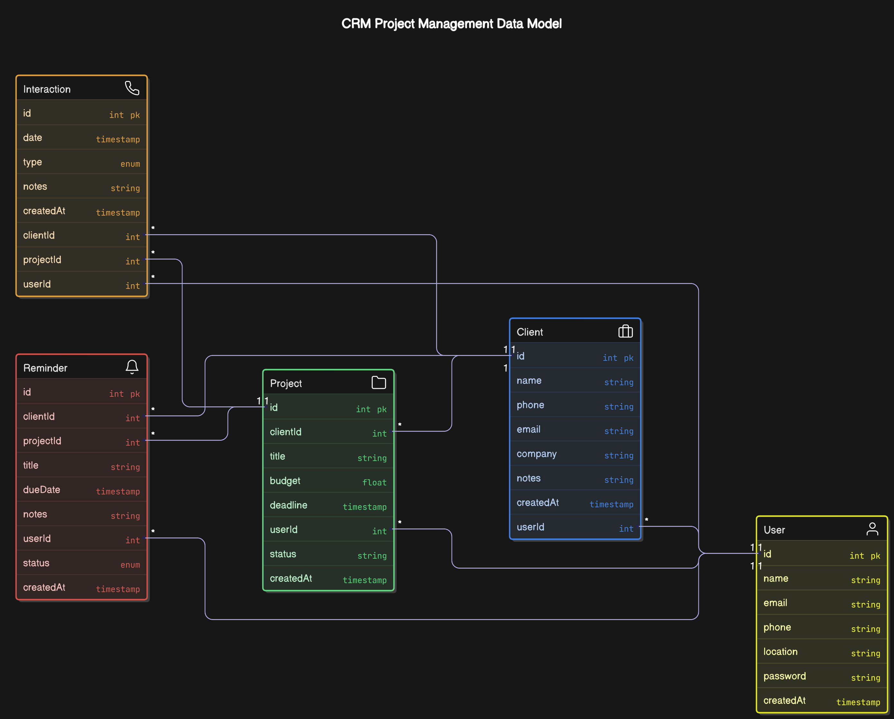

# 🌟 Mini-CRM

A lightweight, powerful CRM (Customer Relationship Management) application to manage clients, projects, meetings, and reminders — built with **React**, **Node.js**, **Express**, **PostgreSQL**, **Prisma ORM**, and **TypeScript**.

---

## 🚀 Features

### 🔒 Authentication
- Secure **Signup** and **Login** system
- Passwords are hashed securely using **bcrypt**
- **JWT (JSON Web Token)** used for authentication
- Tokens stored in **Local Storage** for persistent sessions
- All sensitive routes are protected — only authenticated users can access them

> **JWT Features:**
> - Stateless authentication (no session storage needed on the server)
> - Secure and scalable
> - Easy user verification with token expiration control  
>
> **Local Storage Features:**
> - Persists data even after page refresh
> - Simple API for storing and retrieving tokens
> - Best suited for non-sensitive data storage on client-side

---

### 👤 Clients Management
- **CRUD Operations**: Create, View, Update, and Delete clients
- **Required Fields**: `Name`, `Email`, `Phone`
- **Optional Fields**: `Company`, `Notes`
- Each user manages their **own** clients independently

---

### 📈 Projects Management
- Projects are **linked** to individual clients
- **CRUD Operations**: Full control over project data
- **Required Fields**: `Title`, `Budget`, `Deadline`, `Status`

---

### 📞 Interaction Logs
- Log calls, meetings, or emails related to clients or projects
- **Fields**: `Date`, `Interaction Type`, `Notes`
- Track all communication easily

---

### ⏰ Reminders
- Add **Reminders** linked to clients or projects
- View a summary of **upcoming reminders** for the week
- Never miss important follow-ups again!

---

### 📊 Dashboard Overview
- Beautiful overview with important metrics:
  - 🔹 Total Clients
  - 🔹 Total Projects
  - 🔹 Reminders Due Soon
  - 🔹 Projects by Status
- Easy to visualize and navigate

---

## 🛠️ Tech Stack

### Frontend
- **React** (with **TypeScript**)
- **TailwindCSS** for beautiful UI
- **SweetAlert2 (swal2)** for alerts and modals
- **React Router Dom** for navigation
- **Axios** for API calls

> **Frontend Prerequisites**: Node.js installed

---

### Backend
- **Node.js** + **Express**
- **TypeScript** for robust backend structure
- **PostgreSQL** Database
- **Prisma ORM** for database communication
- **JWT Authentication**
- **bcrypt** for password hashing
- **CORS** and **dotenv** for environment configuration

> **Backend Prerequisites**:  
> - Node.js installed  
> - PostgreSQL installed and running

---

## ⚙️ Installation & Setup

### Backend Setup
```bash
git clone <your-repo-url>
cd backend
npm install
npx prisma migrate dev
# Provide migration name when prompted
npm run dev
```
- To start Prisma Studio (optional for DB visualization):
```bash
npx prisma studio
```

### Frontend Setup
```bash
cd frontend
npm install
npm run dev
```

---

## 🗺️ Entity Relationship Diagram (ERD)

📌  

---

## 📚 Documentation

For **detailed documentation**, visit 👉 [Documentation Link](https://docs.google.com/document/d/1p2s4AADD3wTnqJnRIuMsVGvf3nFN3ZTJ_Uv3uYjqvl4/edit?usp=sharing)

---

## 💡 Future Improvements
- Add file upload functionality (attachments with clients/projects)
- Implement real-time notifications
- Advanced dashboard analytics
- Dark mode UI option

---

## 🙌 Acknowledgements
- Prisma ORM
- PostgreSQL
- TailwindCSS
- React Router Dom
- SweetAlert2

---

## 🧑‍💻 Author

**Md Jahidul Islam Supta**

---

# 🌟 Thank you for visiting Mini-CRM! 🌟
